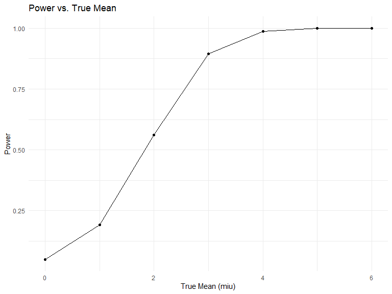

p8105_hw5_bh2852
================
Beicheng Huang
2023-11-16

### Problem 0

``` r
library(tidyverse)
```

\##Quesetion 2

``` r
data_col = tibble(filename = list.files("./data/"))

read_all = function(csv, path = "./data/") {
  paste(path, csv, sep = "/") |> 
  read.csv()
}


long_study =  
  data_col |> 
  mutate(nested_data = map(data_col$filename, read_all)) |> 
  unnest(nested_data) |> 
  mutate(arm_subject = map_chr(.x = filename, ~ unlist(str_split(.x, "\\.") ) [[1]] )) |> 
  mutate(arm = map_chr(.x = arm_subject, ~ unlist(str_split(.x, "_") ) [[1]] )) |> 
  mutate(subject_id = map_chr(.x = arm_subject, ~ unlist(str_split(.x, "_") ) [[2]] )) |> 
  select(-filename, -arm_subject)
```

``` r
pivot_longer = 
  long_study |> 
  pivot_longer(week_1:week_8,
               names_to = "week",
               names_prefix = "week_", #removes the week prefix
               values_to = "value") |> 
  mutate(week = as.integer(week))

spaghetti_plot = 
  pivot_longer |> 
  ggplot(aes(week, value, color = subject_id)) + 
  geom_line() + 
  facet_wrap(~arm) + 
  labs(x = 'Week', y = 'Value', title = 'Spaghetti Plot', color = "Subject ID")

spaghetti_plot
```


\##Q3

``` r
set.seed(114)

n <- 30
sigma <- 5
alpha <- 0.05
mius <- c(0, 1, 2, 3, 4, 5, 6)
```

``` r
sim_mean_sd = function(n = 30, miu, sigma = 5) {
  simulation = tibble(
    x = rnorm(n, mean = miu, sd = sigma),
  )
  
  simulation |> 
    summarize(
      miu_hat = mean(x),
      sigma_hat = sd(x)
    )
}
```

``` r
perform_t_test <- function(n, miu, sigma) {
  sample <- rnorm(n, mean = miu, sd = sigma)
  test_result <- t.test(sample, miu = 0)
  broom::tidy(test_result)
}
```

``` r
results <- tibble(miu = numeric(), miu_hat = numeric(), p_value = numeric(), reject = logical())
```

``` r
for (miu in mius) {
  for (i in 1:5000) {
    sim_results <- sim_mean_sd(n, miu, sigma)
    t_test_results <- perform_t_test(n, miu, sigma)
    results <- results |> 
      add_row(miu = miu, 
              miu_hat = sim_results$miu_hat, 
              p_value = t_test_results$p.value, 
              reject = t_test_results$p.value < alpha)
  }
}
```

``` r
power_results <- results |> 
  group_by(miu) |> 
  summarise(power = mean(reject))
```

``` r
power_results |> 
  ggplot(aes(x = miu, y = power)) +
  geom_point() +
  geom_line() +
  labs(title = "Power vs. True Mean", x = "True Mean (miu)", y = "Power")
```


This graph shows the relation between the proportion of times that null
was rejected on the y axis and true mean of μ on the x axis. As the true
mean increases, the proportion of times that null will be rejected
increases, thus the power of the test increases and approaches 1. This
means that the larger the true means, the easier to reject the null
hypothesis, thus having greater power.

``` r
estimates_data <-
  results |> 
  group_by(miu) |> 
  summarize(avg_miu_hat = mean(miu_hat))

estimates_rejection_df =
  results |> 
  mutate(decision = ifelse(p_value < 0.05, "reject", "fail to reject")) |> 
  filter(decision == "reject") |> 
  group_by(miu, decision) |> 
  summarize(avg_miu_hat_rejected = mean(miu_hat))
```

    ## `summarise()` has grouped output by 'miu'. You can override using the `.groups`
    ## argument.

``` r
estimates_data |> 
  ggplot(aes(x = miu)) +
  geom_point(aes(y = avg_miu_hat, color = "Average Estimate of μ"), shape = 1) +  
  geom_line(aes(y = avg_miu_hat, color = "Average Estimate of μ")) +
  geom_point(data = estimates_rejection_df, aes(y = avg_miu_hat_rejected, color = "Rejected Average Estimate of μ"), shape = 2) +
  geom_line(data = estimates_rejection_df, aes(y = avg_miu_hat_rejected, color = "Rejected Average Estimate of μ"), linetype = "dashed") +
  labs(
    title = "Average Estimated Mean vs. True Mean",
    x = "True Mean (miu)",
    y = "Average Estimated Mean",
    color = "miu_hat"
  ) +
  scale_color_manual(
    values = c("Average Estimate of μ" = "darkgreen", "Rejected Average Estimate of μ" = "red")
  ) 
```


